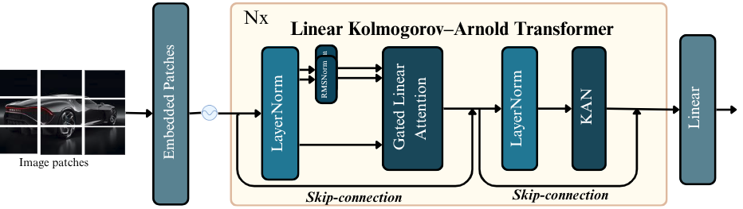
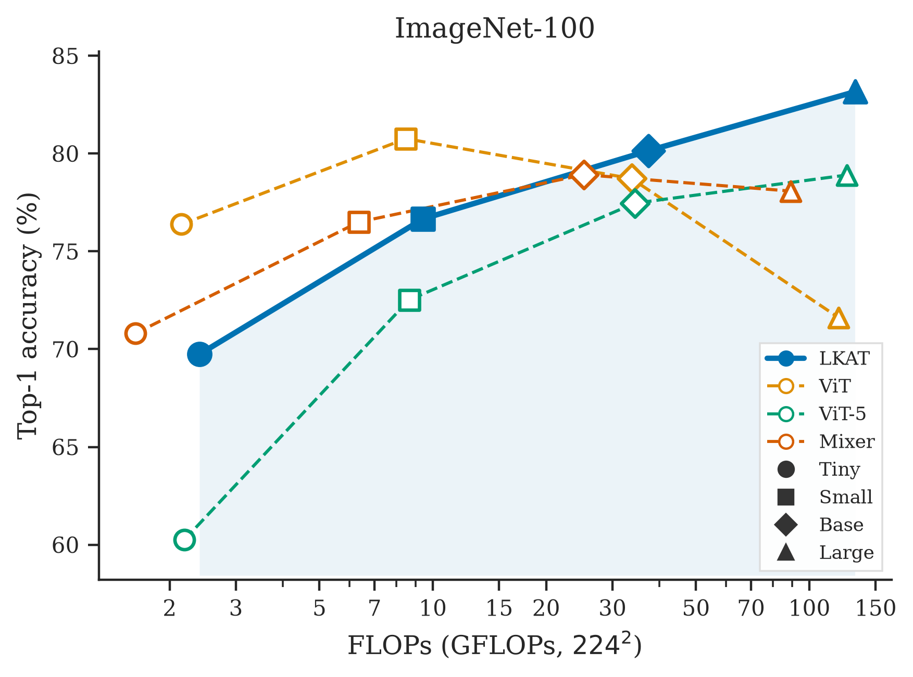
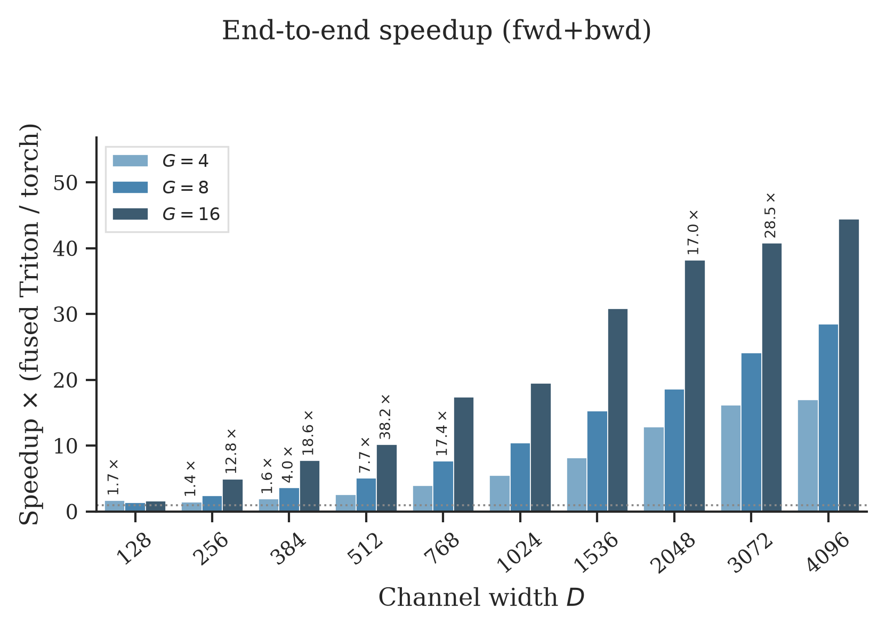

# LKAT: Linear Kolmogorov–Arnold Transformer

**Rethinking Vision Architectures with Gated Linear Attention and KAN**

Paper: [arXiv:2609.22506](https://arxiv.org/abs/2609.22506) · Code: [GitHub](https://github.com/mehizelali/linear-kan-transformer) · Project page: https://mehizelali.github.io/linear-kan-transformer/

## Abstract

Vision Transformers devote most of their parameters to MLPs for channel mixing, but still rely on quadratic multi-head self-attention for token interactions. While linear attention fixes the complexity problem, bringing it down to $\mathcal{O}(N)$, it is usually just paired with the same fixed-activation MLP as before. Kolmogorov–Arnold Networks take a different approach, placing learnable univariate functions on the edges instead. However, existing vision KANs either retain standard attention or remove attention entirely, so the two ideas have not been effectively combined. We introduce *LKAT* (Linear Kolmogorov–Arnold Transformer) to close this gap: an isotropic ViT-style encoder that couples chunk-wise Gated Linear Attention with a two-layer KAN feed-forward block, backed by an I/O-aware fused RBF–KAN kernel to make radial-basis grid functions efficient in practice. Under a shared DeiT-style training recipe, LKAT-B outperforms ViT-B/16, ViT-5-B, and Mixer-B/16 on ImageNet-100, while Tiny, Small, and Base variants scale consistently on CIFAR-10/100. ImageNet-100 pretraining also transfers effectively to CIFAR fine-tuning, suggesting that gated linear attention and KAN-based radial basis functions provide complementary inductive biases for mid-scale visual representation learning.

---

## Architecture



---

## Scaling (ImageNet-100)

Color = family (LKAT / ViT / ViT-5 / Mixer). Marker = scale (T ○ / S □ / B ◇ / L △). Light shaded **LKAT Pareto** front highlights better Acc@1 at similar compute.



Fused RBF–KAN kernel (forward / backward speedup):



---

## Installation

```bash
git clone https://github.com/mehizelali/linear-kan-transformer.git
cd linear-kan-transformer
pip install -r requirements.txt
```

CUDA is required. For Flash Linear Attention, see the FLA install notes in `requirements.txt` (or install from [fla-org/flash-linear-attention](https://github.com/fla-org/flash-linear-attention)).

---

## Quick start

```bash
python train.py -c yaml/lkat_b_imagenet100.yaml
python train.py -c yaml/lkat_t_cifar10.yaml
```

Optional overrides:

```bash
python train.py -c yaml/lkat_b_imagenet100.yaml epochs=10 batch_size=128
```

---

## Citation

If you use this repository, please cite:

```bibtex
@misc{mehizel2026lkat,
  title         = {Rethinking Vision Architectures with Gated Linear Attention and {KAN}},
  author        = {Mehizel, Ali and Khaldi, Oussama},
  year          = {2026},
  eprint        = {2609.22506},
  archivePrefix = {arXiv},
  primaryClass  = {cs.CV},
  url           = {https://arxiv.org/abs/2609.22506}
}
```

This work builds on **Flash Linear Attention (FLA)** and **FastKAN**. Please also cite:

```bibtex
@software{yang2024fla,
  title  = {{FLA}: A {Triton}-Based Library for Hardware-Efficient Implementations of Linear Attention Mechanism},
  author = {Yang, Songlin and Zhang, Yu},
  url    = {https://github.com/fla-org/flash-linear-attention},
  year   = {2024}
}

@article{yang2024gated,
  title   = {Gated Linear Attention Transformers with Hardware-Efficient Training},
  author  = {Yang, Songlin and Wang, Bailin and Shen, Yikang and Panda, Rameswar and Kim, Yoon},
  journal = {arXiv:2312.06635},
  year    = {2024}
}

@article{li2024fastkan,
  title   = {Kolmogorov-Arnold Networks are Radial Basis Function Networks},
  author  = {Li, Ziyao},
  journal = {arXiv:2405.06721},
  year    = {2024}
}
```

---

## Acknowledgements

We thank Ayoub Asri, and Lizhong Chen for their support, and AI GRID for providing computational resources (NVIDIA RTX 5090).
# linear-kan-transformer
